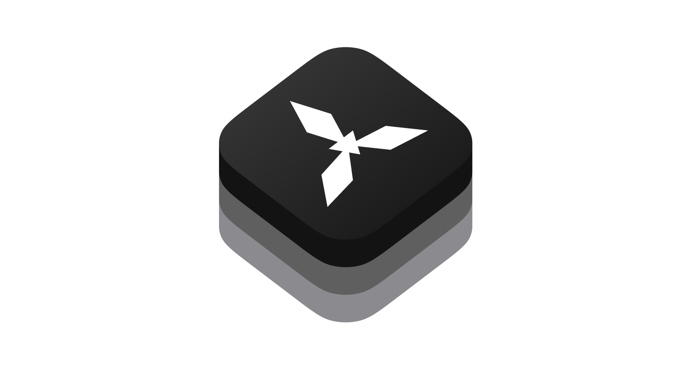

# XCTest Interface Adapter

XCTest Interface Adapter is a microlibrary that imitates an `XCTFail` and it can be called from anywhere.

```swift
import XCTestInterfaceAdapter
```
## Example

Imagine that you have an analytics dependency that is used all over your application:

```swift

// MARK: - AnalyticsClient

protocol AnalyticsClient {

    /// Log some analytics event
    ///
    /// - Parameter event: some event
    func log(_ event: AnalyticsEvent)
}

...

// MARK: - AnalyticsClientImplementation

final class AnalyticsClientImplementation {

    // MARK: - Properties

    /// All available analytics engines (Firebase, CloudKit etc.)
    private let engines: [AnalyticsEngine]

    // MARK: - Initializers

    /// Default initializer
    ///
    /// - Parameter engines: all available analytics engines (Firebase, CloudKit etc.)
    init(engines: [AnalyticsEngine]) {
        self.engines = engines
    }
}

// MARK: - AnalyticsClient

extension AnalyticsClientImplementation: AnalyticsClient {

    func log(_ event: AnalyticsEvent) {
        engines.forEach {
            $0.sendAnalyticsEvent(named: event.name, metadata: event.metadata)
        }
    }
}

```

If you are disciplined about injecting dependencies, you probably have a lot of objects that take an analytics client as an argument (or maybe some other fancy form of DI):

```swift
final class LoginViewController: UIViewController {
    ...

    init(analytics: AnalyticsClient) {
      ...
    }

    ...
}
```

When testing this view model you will need to provide an analytics client. Typically this means you will construct some kind of "test" analytics client that buffers events into an array, rather than sending live events to a server, so that you can assert on what events were tracked during a test:

```swift
func testLogin() {
    let viewModel = LoginViewModel(
        analytics: AnalyticsClientImplementation(engines: engines)
    )
    ...
    XCTAssertEqual(loggedEvents, [.loginSuccess])
}
```

This works really well, and it's a great way to get test coverage on something that is notoriously difficult to test.

However, some tests may not use analytics at all. It would make the test suite stronger if the tests that don't use the client could prove that it's never used. This would mean when new events are tracked you could be instantly notified of which test cases need to be updated.

One way to do this is to create an instance of the `AnalyticsClient` type that simply performs an `XCTFail` inside the `log` endpoint:

```swift
import XCTest

// MARK: - FailingAnalyticsManager

final class FailingAnalyticsManager {
}

// MARK: - AnalyticsManager

extension FailingAnalyticsManager: AnalyticsManager {

    func log(_ event: AnalyticsEvent) {
        XCTFail("AnalyticsClient.log is unimplemented.")
    }
}
```

With this you can write a test that proves analytics are never tracked, and even better you don't have to worry about buffering events into an array anymore:

```swift
func testValidation() {
    let viewModel = LoginViewModel(
        analytics: FailingAnalyticsManager()
    )
    ...
}
```

You cannot ship this code with the target that defines `AnalyticsClient`. You either need to extract it out to a test support module (which means `AnalyticsClient` must also be extracted), or the code must be confined to a test target and thus not shareable.
However, with `XCTestInterfaceAdapter` we can do it. We can define both the client type and the failing instance right next to each in application code without needing to extract out needless modules or targets:

```swift
// MARK: - AnalyticsClient

protocol AnalyticsClient {

    /// Log some analytics event
    ///
    /// - Parameter event: some event
    func log(_ event: AnalyticsEvent)
}

import XCTestInterfaceAdapter

// MARK: - FailingAnalyticsManager

final class FailingAnalyticsManager {
}

// MARK: - AnalyticsManager

extension FailingAnalyticsManager: AnalyticsManager {

    func log(_ event: AnalyticsEvent) {
        XCTFail("AnalyticsClient.log is unimplemented.")
    }
}
```

## License

This library is released under the MIT license. See [LICENSE](LICENSE) for details.
Thanks [pointfree](https://github.com/pointfreeco/xctest-dynamic-overlay) very much for their idea 🖤
